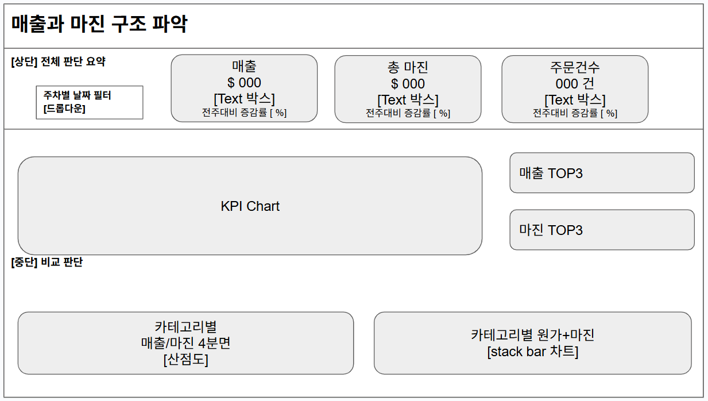
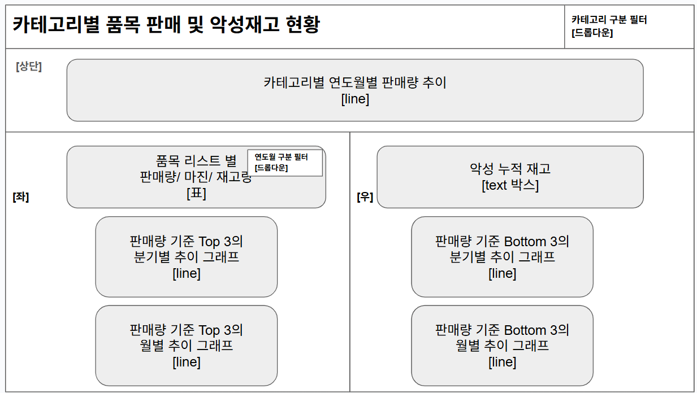

# 3팀 BI 기획서

## **[1] 분석 상황 및 맥락 (Context)**

<aside>
📌 **수익성 개선을 위해 카테고리 별 매출, 총 마진, 악성 재고 현황을 통합 모니터링 해야 하는 상황**

</aside>

- 카테고리별 매출 대비 마진 효율을 파악할 수 있는 수익 분석 지표가 부족함
- 저매출·고마진 품목 등 전략적 확대 대상을 식별하는 체계가 미비함
- 악성 재고에 선제적으로 대응할 수 있는 관리 체계가 부재함

---

## **[2] 핵심 청자 (Stakeholder)**

<aside>
👤 **MD팀 팀장**

</aside>

상품 소싱부터 프로모션, 가격 정책 및 재고 운영 전반에 대한 최종 의사결정 권한을 가짐

---

## **[3] 비즈니스 질문 구조화**

### 1️⃣ 우선순위형 질문

- 가용 리소스를 우선 투입해야 할 핵심 카테고리는 어디인가?

- 매출·마진 구조 상 수익 개선 효과가 가장 높은 카테고리는 어디인가?

---

### 2️⃣ 상태확인형 질문

- 현재 매출, 총 마진, 주문 건수의 전주 대비 증감 현황은 어떠한가?

- 카테고리 내 주요 품목의 판매량, 마진, 악성 재고 현황은 어떠한가?

---

### 3️⃣ 비교판단형 질문

- 카테고리별 매출 대비 마진 기여도와 원가 비중의 차이는 어떠한가?
- 판매 상위(Top 3)와 하위(Bottom 3) 품목 간의 분기·월별 성장 추이는 어떠한가?
- 품목별 악성 재고로 인한 실질적인 손실 규모는 얼마인가?

---

## **[4] KPI 정의**

| KPI | 정의 | 산출식 | 사용 테이블 |
| --- | --- | --- | --- |
| `gross_value`  | 매출 | quantity x mrp | order_items, products, orders |
| `gross_profit`  | 총 마진 | (mrp - price) × quantity | order_items, products, orders |
| `count(order_id)`  | 주문 건수 | order_id | order_items, products, orders |

---

## **[5] 대시보드 페이지 구성**

### Page1

> 매출과 마진 구조 파악
> 
- 목적

<aside>

- 핵심 지표의 변동성 및 카테고리별 마진 구조 비교를 통한 수익 전략 결정
</aside>

- 핵심 차트
    - `[KPI 스코어카드]`
        - 매출, 마진, 주문건수 + 전주 대비 증감률
    - `[산점도]`
        - 카테고리별 매출 - 마진 4분면
    - `[Stacked Bar]`
        - 카테고리별 원가+마진 비중 (카테고리별 마진율 구조 파악)
    - `[Text]`
        - 매출 Top 3 카테고리  및 마진 Top 3 카테고리
- 데이터 소스
    - orders, product, order_items, customers

### Page 2

> 카테고리별 품목 판매 및 재고 현황
> 
- 목적

<aside>

- 품목 단위 성과·악성 재고 및 추이 분석을 통한 재고 운영 우선순위 결정
</aside>

- 핵심 차트
    - 품목별 상세 현황
    - 악성 재고  현황
    - `[Line]`
        - 카테고리별 연월별 판매량 추이
    - `[Line]`
        - 판매량 기준 Top 3(분기별) 및 Bottom 3(월별) 추이 그래프
- 데이터 소스
    - orders, inventory, product, order_items

---

## **[6] 와이어프레임**

### 1 page

### 2 page

